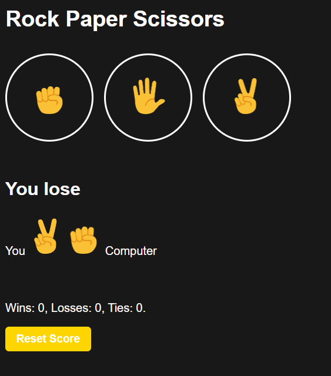

# Rock Paper Scissors Game

## Overview

A classic Rock Paper Scissors game where players compete against the computer in this timeless hand game.

## How to Play

1. **Choose your move**: Click on Rock, Paper, or Scissors
2. **Computer's turn**: The computer randomly selects its move
3. **Result**: The game displays whether you win, lose, or tie
4. **Score tracking**: Wins, losses, and ties are automatically updated
5. **Reset**: Use the "Reset Score" button to start fresh

## Game Rules

- **Rock** beats **Scissors**
- **Scissors** beats **Paper**
- **Paper** beats **Rock**
- Same moves result in a **tie**

## Features

- Real-time score tracking (Wins, Losses, Ties)
- Reset score functionality
- Instant game results
- Play against computer AI

## Technologies Used

- HTML
- CSS
- JavaScript
